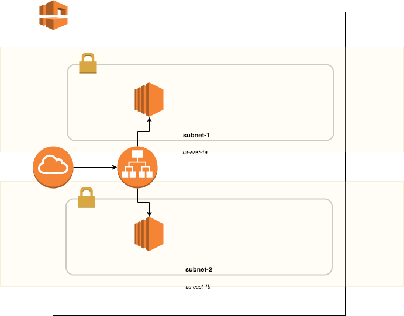

# AWS Meetup -- Terraform

## [Demo 1](https://github.com/nllarson/aws-terraform-example/tree/demo1)
Build out a basic [infrastructure](#DemoInfrastructure) plan using basic Terraform syntax. 
Often as a first step of learning a new tool like Terraform, it is nice to know how the basic pieces fit together.  This demo / example is intented to do that.

## [Demo 2](https://github.com/nllarson/aws-terraform-example/tree/demo2)
Build out a basic [infrastructure](#DemoInfrastructure) plan using basic Terraform syntax. 
Making plans repeatable by way of variables, loops and lookups.  This demo is intended to explore how to write your plans in a more reusable fashion.

## [Demo 3](https://github.com/nllarson/aws-terraform-example/tree/demo3)
Build out a basic [infrastructure](#DemoInfrastructure) plan using basic Terraform syntax. 
Using [modules](https://www.terraform.io/docs/configuration/modules.html), we can consolidate plans that your organization / team tend to use as basic building blocks of your infrastructure.  This demo will show how to break out reusable pieces of infrastructure into modules, and use them to build the plan.

## [Demo 4](https://github.com/nllarson/aws-terraform-example/tree/demo4)
Build out a basic [infrastructure](#DemoInfrastructure) plan using basic Terraform syntax. 
Leveraging modules is great!  Seperation of concerns across the infrastructure can make things easier to manage.  For example, a team of Network Engineers might be the group responsible for changes to the VPC / Subnet configuration.  Where the individual application teams are responsbile for their build out of servers to run their application.  Seperating out these pieces in your plans will allow each team to work independently, and using [Data Sources](https://www.terraform.io/docs/configuration/data-sources.html) references, they can keep things in sync across runs.  This demo will show how to break up the infrastructure plans into smaller independent pieces that can be controlled independently.

----

### Demo Infrastructure

#### Networking Tier
 :white_check_mark: 1 VPC
 :white_check_mark: 2 public subnets (us-east-1a, us-east-1b)
 :white_check_mark: Internet Gateway

#### Application Tier
 :white_check_mark: Application Load Balancer
 :white_check_mark: 2 EC2 Instances distributed between AZs, behind loadbalancer

### Links / References
[Providers](https://www.terraform.io/docs/configuration/providers.html)

[Resources](https://www.terraform.io/docs/configuration/resources.html)

[Resource References](https://www.terraform.io/docs/configuration/interpolation.html#attributes-of-other-resources)

[Modules](https://www.terraform.io/docs/configuration/modules.html)

[Data Sources](https://www.terraform.io/docs/configuration/data-sources.html)

